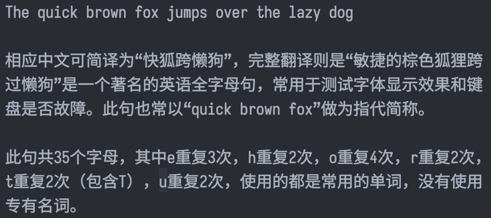
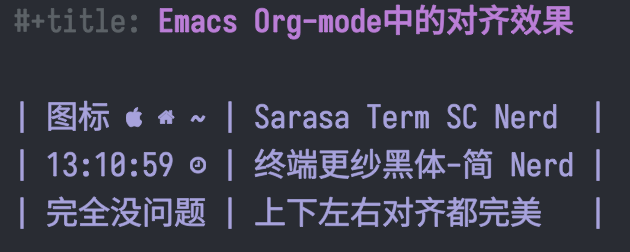

# `Sarasa Term SC Nerd` 字体

## 关于

`Sarasa Term SC Nerd` 字体是以 [Sarasa Term
SC](https://github.com/be5invis/Sarasa-Gothic)字体为基础，修改了[Nerd
fonts](https://github.com/ryanoasis/nerd-fonts)字体补丁程序，然后用该程序将`Nerd
fonts`合并入`Sarasa Term SC`, 再经过一些后处理，而最后形成的字体。该字体特别适合
**简体中文**用户在**终端**或者**代码编辑器**中使用。

上游版本：

- Sarasa Term SC：0.40.1
- Nerd Font: 2.3.3
- Font Patcher: 3.5.4

## 字体效果

- 文字效果（以 Regular 样式为例）
  
- 图标效果
  
- 对齐效果：终端里 emacs/org-mode 中的表格对齐
  

## 特性

- `等距更纱黑体 SC` 是极少数做到中文和英文 2:1 严格对齐的字体，特别适合用来写代
  码, 以及中英文混合的字符式表格的对齐等。
- `Nerd fonts` 提供了很多图标字体，特别适合各种 Zsh/Bash/Vim/NeoVim/Emacs 主题，
  例如 zsh 的 [`p10k`](https://github.com/romkatv/powerlevel10k),
  [`Powerline`](https://github.com/powerline/powerline) 等等。
- 一些符号进行了纵向拉伸，不会出现`Powerline`条带中高低不一，无法上下对齐的情况。
- 原始`Sarasa Term SC`字体和`Sarasa Term SC Nerd`字体可以共存，不会产生冲突。
- 将 `OS/2` 表中的 `xAvgCharWidth` 属性进行了设置，避免了在 windows 系统下，一些
  不支持新版本 `OS/2` 表的软件中字距不正常的问题。
- 加入了`hdmx`表，解决了 windows 系统下的一些情况下无法严格对齐的问题。
- 修正了`OS/2`表中的`panose`和`post`表中的`isFixedPitch`，使得字体被系统认出是等
  宽字体。

## 安装

- MacOS 用户可以直接通过 cask 安装：
  ```sh
  brew tap laishulu/cask-fonts
  brew install --cask font-sarasa-nerd
  ```
- ArchLinux 用户可以使用 yay 安装：
  ```sh
  yay -S nerd-fonts-sarasa-mono
  ```
- Gentoo 用户可以添加`gentoo-zh`安装：
  ```sh
  sudo eselect repository enable gentoo-zh
  sudo emerge --sync
  sudo emerge -av media-fonts/sarasa-mono-sc-nerd
  ```
- 手工下载安装：
  - 下载 https://github.com/laishulu/Sarasa-Term-SC-Nerd/releases/latest/download/sarasa-mono-sc-nerd.zip
  - 将 `sarasa-mono-sc-nerd.zip` 解压即可得到字体文件。

## 使用

在你的主题配置文件中，使用 `Sarasa Term SC Nerd`。

## 如何生成字体

1. 进入 `nerd font` 源码目录，以下所有操作都在此目录下进行。
2. 将本项目 `scripts` 目录下的文件（不含`script`目录自身）拷贝过去。
3. 安装`fontpatcher`
   ```
   wget https://github.com/ryanoasis/nerd-fonts/releases/latest/download/FontPatcher.zip
   unzip FontPatcher.zip && rm -rvf FontPatcher.zip
   ```
4. 安装 `python` 环境
   ```
   brew install fontforge
   rm Pipfile*
   pipenv --site-packages --python=/Applications/FontForge.app/Contents/Frameworks/Python.framework/Versions/Current/bin/python3
   pipenv install argparse fonttools
   ```
5. 建立 `sarasa` 目录，并将原始`Sarasa Term SC`字体文件放入该目录中。
6. 运行脚本 `./build`，在 `sarasa-nerd`目录下将生成`.ttf`字体文件。同时，所有的
   `.ttf`也被打包成一个`.ttc`字体合集文件。
